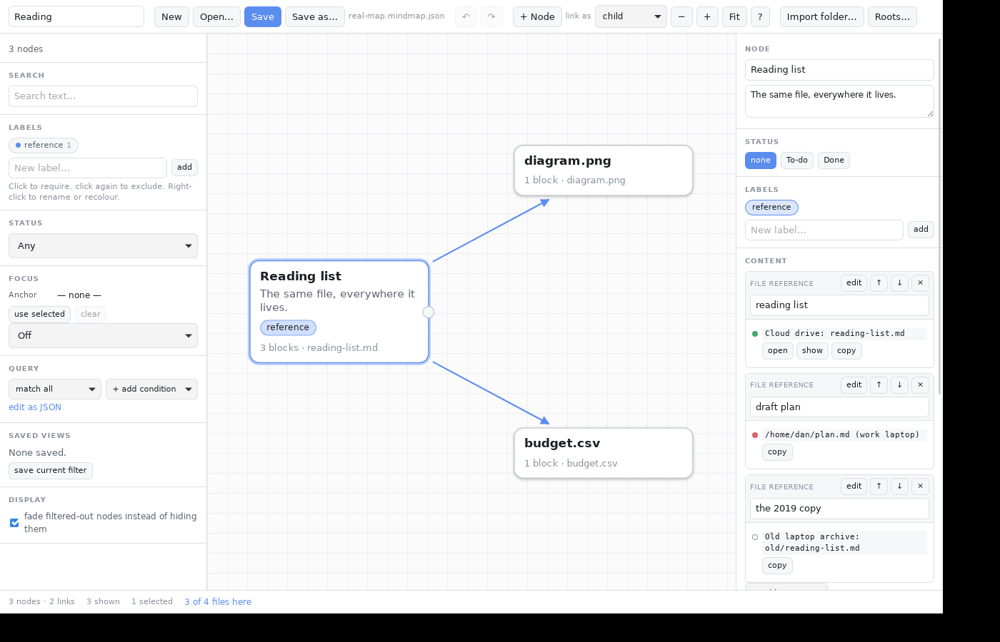

# mind-map

A mind map editor for things that refuse to live in one folder. Local-only, no
server, no account. Runs as a desktop app with real file access, or as a plain
page in a browser tab.


## Why this exists

Directory trees don't work for everyone. You create a folder in the place that
makes sense *today*, and six months later the thing you filed has taken on a
second identity and you can't find it. A tree forces one parent; reality has
many.

This is a place to **drop things next to the topic they're relevant to**,
spatially, so your memory has something to grab onto — and to **draw a new line
later** when something gains a new association, without moving or copying
anything.

Design consequences of that goal:

- **A graph, not a tree.** Any node can link to any node. Hierarchy is one kind
  of edge among several, not the structure of the data.
- **Position is meaningful.** Node coordinates are saved and nothing
  re-arranges itself. Where you put something is part of how you remember it.
- **Additive, never destructive.** New connections are new edges. You never
  give up the old association to record a new one.
- **Everything is filterable.** With many overlapping associations in one map,
  hiding what you're not thinking about right now is the feature that makes the
  rest usable.

## Running it

**In a browser** — the UI has no build step and no dependencies, so any static
server will do. ES modules need a real origin, so `file://` won't work:

```sh
npm run serve      # or: python3 -m http.server 8000
```

Then open <http://localhost:8000/>.

**As a desktop app** — this is the build that can actually open your files:

```sh
npm install        # fetches the Tauri CLI; the UI itself stays dependency-free
npm run dev        # develop, with reload
npm run build      # produce an installer for this platform
```

Needs a [Rust toolchain](https://rustup.rs) and your platform's webview
development packages, which [Tauri's prerequisites
page](https://v2.tauri.app/start/prerequisites/) lists. If you would rather not
set that up, the `build` workflow produces binaries for Linux, macOS and Windows
on every push.

### Which build can do what

| | Browser tab | Desktop app |
| --- | --- | --- |
| Editing, filtering, everything about the map | yes | yes |
| Save back to the file you opened | Chromium only | yes |
| Open a referenced file in its own program | no | yes |
| Browse folders, import a folder of files | no | yes |

Your map is a JSON file you choose. There's a localStorage autosave underneath
as a crash net, and the toolbar always tells you which one you're relying on.
File references are recorded in both builds — a browser tab simply can't open
them, and says so instead of offering a button that fails.

## Using it

| | |
| --- | --- |
| **Add a node** | double-click the background, or `n`, or `Ctrl`+`K` and type a name that doesn't exist |
| **Add a child** | select a node and press `Tab` |
| **Link two nodes** | drag the dot on a card's right edge onto another card |
| **Find anything** | `Ctrl`+`K` |
| **Mark to-do / done** | `t`, or click the dot on the card |
| **Rename in place** | double-click the title, or `Enter` |
| **Select a region** | shift-drag the background |

Press `?` in the toolbar for the full list.

### Filtering

Three tiers, all of which compile to the same underlying query:

1. **Label chips** cycle neutral → require → exclude. Hiding everything tagged
   `work` is two clicks. Labels are yours to define — `work` and `personal` are
   just what the starter map happens to use.
2. **Focus** takes one node and shows only what relates to it: everything
   within N links, everything under it, everything above it, or its whole
   cluster. Select a node and press `e`, or use "use selected" in the panel.
3. **Query** stacks conditions with AND/OR and a per-row NOT — labels, status,
   text, structured fields, link counts, and the relationship operators. There's
   a raw JSON editor underneath for anything the rows can't express.

Any combination can be saved as a named view, which is stored in the map file.

### Node contents

A node holds an ordered list of typed blocks: markdown, plain text, links, file
references, code, and LaTeX. Blocks of a type this build doesn't recognise are
kept intact on save rather than dropped. `[[Double brackets]]` in markdown link
to another node by title, and offer to create it if it doesn't exist.

Every node also has a free-form `fields` object — arbitrary key/value data,
queryable with the `field` condition, there so you can start recording
structure before the app knows what to do with it.

### Files

A path is a fact about one machine; a map is a thing you carry between
machines. So a file reference holds *every* place that file lives:

- A location relative to a **named root** — say `Cloud drive` — resolves on
  every machine that has mapped that root. The map stores the root's name; each
  machine stores its own path for it (toolbar → **Roots…**). This is the case
  worth aiming for, and picking a file through the dialog does it automatically
  when the file is inside a mapped root.
- An **absolute** location, optionally tagged with the machine it belongs to,
  for the things that genuinely exist in one place.

A dot on each location says where you stand: green is here and openable, red
resolves to a path with nothing at it, hollow means this machine has never been
told where that root is.


 **Import folder…** turns a directory into a
neighbourhood of the map — a node per file, which you can then link to anything
else, which is the part a directory tree can't do.

"Every note that mentions this file" is the `references a file` condition, and
it searches every recorded location — so a file that only exists on your other
laptop still turns up the note about it.

## Extending it

The app is built to be taken apart. Filters, content types and commands are
registries: adding a capability means registering a function, not editing the
renderer.

- [`docs/ARCHITECTURE.md`](docs/ARCHITECTURE.md) — how it fits together and why
- [`docs/EXTENDING.md`](docs/EXTENDING.md) — recipes for new filters, content
  types, commands, edge types and environments
- [`docs/PLATFORMS.md`](docs/PLATFORMS.md) — why there's a native build, how
  portable file references work, and what mobile would still take
- [`docs/ROADMAP.md`](docs/ROADMAP.md) — where the known wants would land, and
  what each would cost

`globalThis.mindmap` is the running app, on purpose. Poke at it.

## Tests

```sh
node --test                                      # the DOM-free core
cargo test --manifest-path src-tauri/Cargo.toml  # the native commands
```

The core suite covers the model, graph traversal, the filter language, the
store, file locators and the Markdown renderer, and runs on node's built-in
runner with nothing installed.

`tests/manual/tauri-bridge.mjs` drives the UI against a scripted stand-in for
the native bridge — useful for the cases that are awkward to stage for real,
like a root this machine hasn't mapped. It needs Playwright, which is why it
isn't part of `node --test`.

## Your data

The document is plain, versioned JSON — readable and diffable without this app,
with a migration chain so old files keep opening. See
[`examples/starter.mindmap.json`](examples/starter.mindmap.json) for a real one.

## Status

Early. The data model and the extension points are the parts designed to last;
the UI is expected to churn as the tool finds its shape. Mobile targets exist in
the native shell but have never been built or run.

## License

MIT. See [LICENSE](LICENSE).
