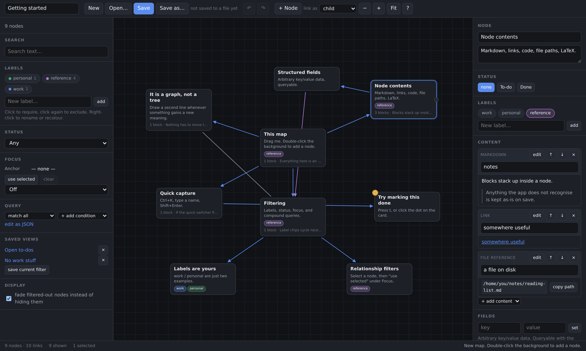

# mind-map

A browser-based mind map editor and viewer. Local-only, serverless, no build
step, no dependencies.



## Why this exists

Directory trees don't work for everyone. You create a folder in the place that
makes sense *today*, and six months later the thing you filed has taken on a
second identity and you can't find it. A tree forces one parent; reality has
many.

This is a place to **drop things next to the topic they're relevant to**,
spatially, so your memory has something to grab onto — and to **draw a new line
later** when something gains a new association, without moving or copying
anything.

Design consequences of that goal:

- **A graph, not a tree.** Any node can link to any node. Hierarchy is one kind
  of edge among several, not the structure of the data.
- **Position is meaningful.** Node coordinates are saved and nothing
  re-arranges itself. Where you put something is part of how you remember it.
- **Additive, never destructive.** New connections are new edges. You never
  give up the old association to record a new one.
- **Everything is filterable.** With many overlapping associations in one map,
  hiding what you're not thinking about right now is the feature that makes the
  rest usable.

## Running it

It's static files, but ES modules need a real origin, so `file://` won't do:

```sh
python3 -m http.server 8000     # or: npx http-server -p 8000 -c-1
```

Then open <http://localhost:8000/>. Any static server works. There is nothing
to install and nothing to build.

Your map lives in a JSON file you choose. In Chromium-based browsers the app
writes back to that file in place (`Ctrl`+`S`); elsewhere Save downloads a copy
and Open takes an upload. Either way there's a localStorage autosave underneath
as a crash net, and the toolbar always tells you which one you're relying on.

## Using it

| | |
| --- | --- |
| **Add a node** | double-click the background, or `n`, or `Ctrl`+`K` and type a name that doesn't exist |
| **Add a child** | select a node and press `Tab` |
| **Link two nodes** | drag the dot on a card's right edge onto another card |
| **Find anything** | `Ctrl`+`K` |
| **Mark to-do / done** | `t`, or click the dot on the card |
| **Rename in place** | double-click the title, or `Enter` |
| **Select a region** | shift-drag the background |

Press `?` in the toolbar for the full list.

### Filtering

Three tiers, all of which compile to the same underlying query:

1. **Label chips** cycle neutral → require → exclude. Hiding everything tagged
   `work` is two clicks. Labels are yours to define — `work` and `personal` are
   just what the starter map happens to use.
2. **Focus** takes one node and shows only what relates to it: everything
   within N links, everything under it, everything above it, or its whole
   cluster. Select a node and press `e`, or use "use selected" in the panel.
3. **Query** stacks conditions with AND/OR and a per-row NOT — labels, status,
   text, structured fields, link counts, and the relationship operators. There's
   a raw JSON editor underneath for anything the rows can't express.

Any combination can be saved as a named view, which is stored in the map file.

### Node contents

A node holds an ordered list of typed blocks: markdown, plain text, links, file
paths, code, and LaTeX. Blocks of a type this build doesn't recognise are kept
intact on save rather than dropped. `[[Double brackets]]` in markdown link to
another node by title, and offer to create it if it doesn't exist.

Every node also has a free-form `fields` object — arbitrary key/value data,
queryable with the `field` condition, there so you can start recording
structure before the app knows what to do with it.

## Extending it

The app is built to be taken apart. Filters, content types and commands are
registries: adding a capability means registering a function, not editing the
renderer.

- [`docs/ARCHITECTURE.md`](docs/ARCHITECTURE.md) — how it fits together and why
- [`docs/EXTENDING.md`](docs/EXTENDING.md) — recipes for new filters, content
  types, commands and edge types
- [`docs/ROADMAP.md`](docs/ROADMAP.md) — where the known wants would land, and
  what each would cost

`globalThis.mindmap` is the running app, on purpose. Poke at it.

## Tests

The DOM-free core — model, graph traversal, the filter language, the store and
the Markdown renderer — has a test suite that runs on node's built-in runner
with nothing installed:

```sh
node --test
```

## Your data

The document is plain, versioned JSON — readable and diffable without this app,
with a migration chain so old files keep opening. See
[`examples/starter.mindmap.json`](examples/starter.mindmap.json) for a real one.

## Status

Early. The data model and the extension points are the parts designed to last;
the UI is expected to churn as the tool finds its shape.

## License

MIT. See [LICENSE](LICENSE).
